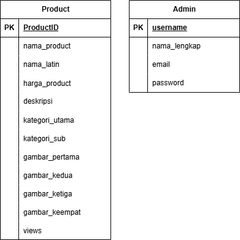

# BotaniMart-catalogue
Tugas Rekayasa Perangkat Lunak  

## 👨‍💻 Development Team

<div align="center">

### **RPL P1 Kelompok 2**

| Name | Student ID | GitHub |
|------|------------|--------|
| 🚀 **Qois Firosi** | `G6401231031` | [@qois51](https://github.com/qois51) |
| 💻 **Luthfi Muharram** | `G6401231056` | [@luthfimhrm](https://github.com/luthfimhrm) |
| 🎨 **M. Ibnu Fadhil** | `G6401231073` | [@Avessu](https://github.com/Avessu) |
| ⚙️ **Naufal Rama Koswara** | `G6401231113` | [@Rama2615](https://github.com/Rama2615) |
| 🗄️ **Muhammad Salman Maulana** | `G6401231153` | [@xmusama](https://github.com/xmusama) |

</div>

## ERD
<div align="center">



</div>


## Panduan Kolaborasi Github
Tutorial workflow github yg menurut gw paling baik : [video](https://www.youtube.com/watch?v=4zkaFCLoQV0)

## Panduan Development
Install package yg dibutuhkan
```
npm install
```

Mulai server
```
npm run dev
```

## STRUKTUR FOLDER
```
project-root/
├── db/                       # Database-related files
│   ├── example.db            # SQLite database file (stores actual data)
│   ├── migrations/           # SQL migration scripts (for database schema changes)
│   ├── seeds/                # Data seeding scripts (for database with initial data)
│   └── db.js                 # Establishes connection with SQLite
│
├── server/                   # Server-side code (handles API, routing, business logic)
│
├── public/                   # Public-facing assets (static files accessible by the client)
│   ├── views/                # HTML file served to users (usually the homepage)
│   │   └── index.html
│   ├── assets/
│   │   ├── css/
│   │   └── js/
│   └── uploads/              # Images
│
├── .gitignore                # Specifies files and folders to ignore in version control (Git)
├── package.json              # Node.js dependencies and project metadata
└── README.md                 # Documentation about the project
```

## Generate New Database
Saat file ``db/central.db`` hilang atau terjadi sesuatu, maka harus generate Database baru.

### Panduannya
Dari root folder jalankan:
```
node db/migrate.js migrate latest
node db/migrate.js seed
```
